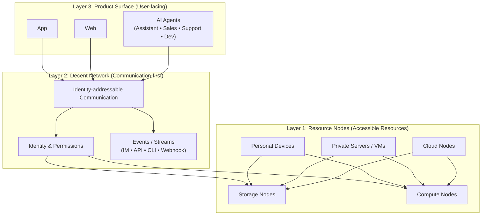
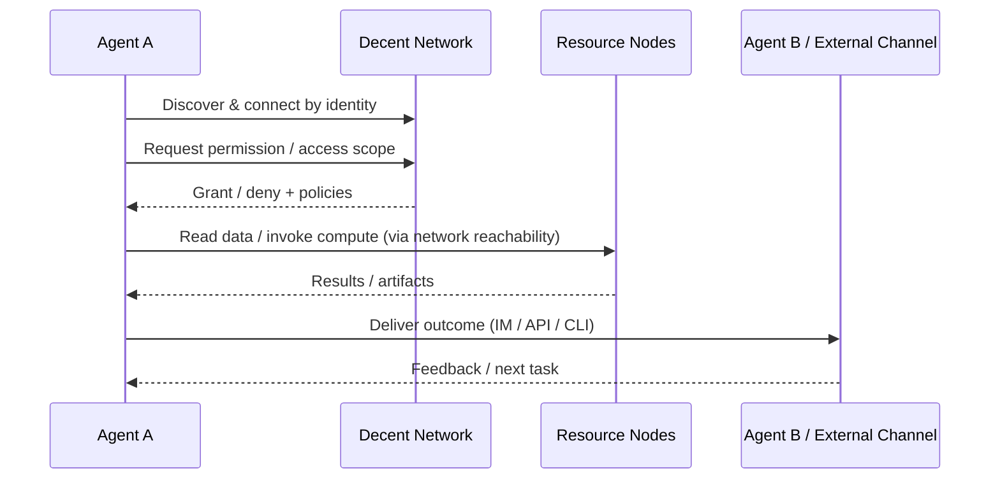

# Whitepaper (Extended): A Three-Layer Architecture for Decent Network × App/Web × Agents

> Audience: Founders / Technical Leaders / Investors  
> This paper focuses on needs, abstractions, and architecture—no implementation details.

---

## Abstract

In the AI + blockchain era, the primary product surfaces are **App / Web / Agents**.  
The real moat comes from: **reachable communication + unified identity/permissions + accessible storage/compute + agent interoperability interfaces**.

**Decent Network** treats **communication** as the first-principles capability. It builds an identity-driven reachable network on top of today’s internet, and on top of that hosts storage and compute nodes—enabling scalable collaboration across Apps/Web and Agents.

---

## 1. Problem: Why today’s internet is hostile to personal devices and the Agent ecosystem

### 1.1 The default worldview: C/S + IP/DNS
The mainstream internet relies on IP/DNS for addressing and is dominated by the client/server model. Most personal devices sit behind NATs/firewalls and are not reachable by default.

### 1.2 A one-way resource structure: “cloud-only”
When endpoints are not reachable, storage and compute are forced into the cloud:
- cost boundaries are dictated by cloud pricing
- privacy and data boundaries are hard to define clearly
- devices controlled by individuals/organizations cannot become usable resource nodes

### 1.3 New hard requirements in the Agent era
As Agents become execution units for organizations, they need:
- independent identities and permission boundaries
- access to data and compute (not only cloud, but also private/personal devices)
- interoperability with external systems and other Agents (IM / API / CLI / Streams)

Without a unified network layer, ecosystems fragment and devolve into piles of connectors/plugins.

---

## 2. Three-Layer Overview

### 2.1 Mermaid Architecture Diagram (GitHub-renderable)


### 2.2 ASCII Fallback Diagram
```
[App]   [Web]   [Agents]
   \      |       /
    \     |      /
 [ Decent Network: identity-addressable communication ]
          |
 [ Accessible Storage & Compute Nodes ]
 (personal devices / private servers / cloud / VMs)
```

---

## 3. Glossary

- **Node**: a network participant—personal devices, private servers, or cloud nodes  
- **Identity**: a node’s unique identifier for discovery, connection, authorization, and audit  
- **Friend Graph**: identity-based relationships and reachable paths  
- **Agent**: an identity-bearing digital executor (assistant/sales/support/dev) primarily operating in natural language  
- **Resource Node**: an accessible provider of storage/compute (personal/private/cloud)  
- **Streams / Events**: I/O channels for systems and Agents (IM/API/CLI/Webhook)

---

## 4. Layer 3: App / Web / Agents (User-facing surfaces)

### 4.1 App
Apps provide experience and reachability (sessions, messaging, notifications, media, and permission interactions).

### 4.2 Web
Web provides distribution, operations, and ecosystem integration—fast iteration, external service integrations, and developer/admin workspaces.

### 4.3 Agents
Agents are GUI-less digital workers (assistant/sales/support/dev) with natural-language as the primary interface.  
Agents collaborate via **IM / API / CLI** and require unified identity, permissions, and resource-access boundaries.

---

## 5. Layer 2: Decent Network (Communication-first)

Decent Network’s first-principles objective is an **identity-reachable communication network**:
- discover/connect by identity, not by IP/DNS
- make personal devices and private servers reachable nodes
- provide unified semantics for communication, identity/permissions, and event streams for App/Web/Agents

Architecturally it answers the core question:  
**“How can personal devices be reachable?”**  
Through identity-driven discovery, routing, and necessary relays, nodes become reachable on top of today’s internet and can participate in communication and collaboration.

---

## 6. Layer 1: Accessible Storage & Compute (Resource Nodes)

Once communication reachability is established, storage and compute no longer have to be cloud-only.  
Resource nodes can come from:
- **personal devices** (phones/PCs): participate in data and compute collaboration
- **private servers/VMs**: host long-running Agents and services
- **cloud nodes**: still useful, but no longer the only option

Under unified identity/permissions semantics, App/Web/Agents can access these resource nodes—forming a mixed resource structure: **cloud + private + personal devices**.

---

## 7. Typical Workflow (An Agent collaboration loop)

### 7.1 Mermaid Workflow Diagram


### 7.2 Text Workflow (Diagram-independent)
1) An Agent discovers and connects by identity  
2) It obtains data/compute access scope under unified permission semantics  
3) It accesses reachable storage/compute nodes (personal/private/cloud)  
4) It delivers outputs via IM/API/CLI and iterates with other Agents or external systems

---

## 8. Use Cases

### 8.1 Founders: ship first, then scale the system
- surfaces: App / Web / Agents (pick one or combine)
- needs: faster launch, lower long-term cost, easier multi-platform scaling
- Decent Network provides: reachable communication + unified identity/permissions + accessible resource nodes

### 8.2 Enterprises: make Agents “manageable digital employees”
- surfaces: sales/support/ops/dev Agents working over IM/API/CLI
- needs: identity isolation, permission boundaries, auditability, controllable data/resources
- Decent Network provides: unified identity/permissions semantics + event streams + accessible resources

### 8.3 Developer ecosystem: interoperability for third-party Agents and apps
- surfaces: third-party Agents/tools integrating via IM/API/CLI
- needs: interoperability, composability, orchestration, extensibility
- Decent Network provides: communication + event streams as the ecosystem coupling layer

---

## 9. Security & Governance (Principles)

This paper states principles only (no implementation details):

- **Identity-first**: all access and collaboration is identity-scoped  
- **Permissioned access**: data/compute/asset access must be explicit and revocable  
- **Auditability by design**: critical actions can be logged and audited  
- **Least privilege**: minimal permissions by default; grant only what is needed  
- **Composable trust**: personal/private/cloud resources can be composed under unified semantics

---

## 10. Conclusion

Decent Network makes **communication reachability** the foundation and turns storage/compute into accessible resources. This enables Apps/Web/Agents to collaborate under unified identity and network semantics—forming a rational architecture for the AI + blockchain era.

It supports:
- traditional App/Web delivery and long-term scaling  
- agent-native digital employee collaboration and ecosystem interoperability  
- a shift from cloud-only to **cloud + private + personal device** resource structures
