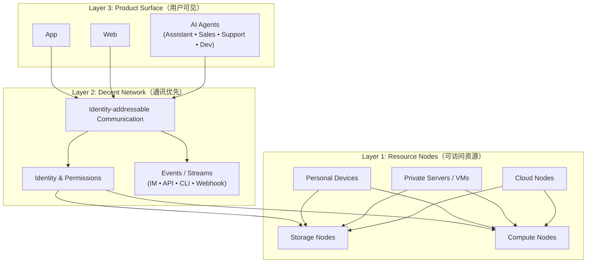
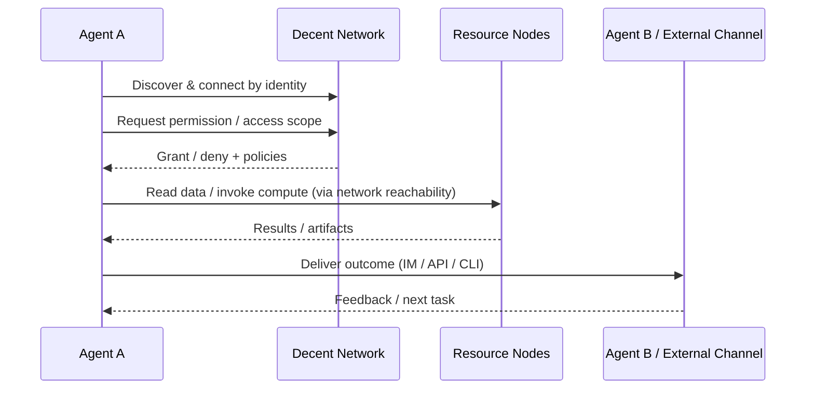

# Whitepaper：Decent Network × App/Web × Agent 的三层架构

> 目标读者：Founder / 技术负责人 / 投资人  
> 本文只描述“需求、抽象与架构”，不展开实现细节。

---

## 摘要

在 AI + 区块链时代，产品交付形态主要是 **App / Web / Agent**。  
系统壁垒来自“通讯可达性 + 统一身份与权限 + 可访问的存储与计算 + Agent 互操作接口”。

**Decent Network** 以“通讯”为第一性能力，在现有互联网之上构建身份驱动的可达网络，并在此之上承载存储与计算节点，最终支撑 App/Web 与 Agent 的规模化协作。

---

## 1. 问题定义：为什么当下的互联网不利于个人设备与 Agent 生态

### 1.1 C/S + IP/DNS 的默认世界观
主流互联网依赖 IP/DNS 寻址，以 C/S 方式提供服务。大多数个人设备位于 NAT/防火墙后，默认不可达。

### 1.2 “只能接云”的单向资源结构
在不可达的前提下，存储与算力被迫集中到云：  
- 成本边界被云资源定价主导  
- 隐私与数据边界难以清晰定义  
- 个人/组织控制的设备很难成为可用资源节点

### 1.3 Agent 时代的新增刚需
Agent 成为组织的执行单元后，需要：
- 具备独立身份与权限边界  
- 可访问数据与算力（不仅是云，也包括私有/个人设备）  
- 与外部系统、其他 Agent 互操作（IM / API / CLI / Stream）  
缺少统一网络层会导致生态碎片化，只能靠插件/连接器堆积。

---

## 2. 三层架构总览

### 2.1 Mermaid 架构图（GitHub 可渲染）

### 2.2 ASCII （备选图）
```
[App]   [Web]   [Agents]
   \      |       /
    \     |      /
 [ Decent Network: identity-addressable communication ]
          |
 [ Accessible Storage & Compute Nodes ]
 (personal devices / private servers / cloud / VMs)
```

---

## 3. Glossary（术语定义）

- **Node（节点）**：加入网络的参与者，可是个人设备、私有服务器或云节点  
- **Identity（身份）**：节点的唯一标识，用于发现、连接、授权与审计  
- **Friend Netword（好友网络）**：基于身份建立的连接关系与可达路径  
- **Agent（智能代理）**：具备身份的数字执行体（助理/销售/客服/开发），主要用自然语言工作  
- **Resource Node（资源节点）**：可被访问的存储/计算提供者（个人设备/私有服务器/云）  
- **Stream / Events（事件流）**：系统与 Agent 的输入/输出通道（IM/API/CLI/Webhook）

---

## 4. Layer 3：App / Web / Agent（用户可见层）

### 4.1 App
App 提供体验与触达入口，典型模块包括会话、消息、通知、媒体与权限交互。

### 4.2 Web
Web 提供分发、运营与生态集成入口，便于快速迭代、接入外部服务、构建面向开发者的工作台。

### 4.3 Agent
Agent 是无 GUI 的数字员工：助理/销售/客服/开发等，以自然语言为主要交互介质。  
Agent 对外通过 **IM / API / CLI** 进行协作，并需要统一的身份、权限与资源访问边界。

---

## 5. Layer 2：Decent Network（通讯优先）

Decent Network 的第一性目标是建立“**身份可达的通讯网络**”：  
- 用身份发现与连接，而不是依赖 IP/DNS  
- 让个人设备/私有服务器成为可达节点  
- 为 App/Web/Agent 提供统一的通讯语义、身份语义与事件流语义

它在架构上回答一个关键问题：  
**“个人设备如何被访问到？”**  
通过身份驱动的发现、路由与必要的中继，节点可以在现有互联网之上获得可达性，从而参与通信与协作。

---

## 6. Layer 1：可访问的存储与计算（Resource Nodes）

通讯可达性建立后，存储与计算不再只能来自云。  
网络中的资源节点可以来自：
- **个人设备**（手机/电脑）：可参与数据与算力协作  
- **私有服务器/虚拟机**：可承载长期运行的 Agent 与服务  
- **云节点**：仍然存在，但不再是唯一选择

在统一身份与权限语义下，App/Web/Agent 可访问这些资源节点，形成“云 + 私有 + 个人设备”的组合型资源结构。

---

## 7. 典型工作流（Agent 协作闭环）

### 7.1 Mermaid 工作流图


### 7.2 文字版（不依赖图）
1) Agent 通过身份发现并建立连接  
2) 在统一权限语义下获得数据/算力访问范围  
3) 访问可达的存储与计算资源节点（个人/私有/云）  
4) 通过 IM/API/CLI 输出结果，并与其他 Agent 或外部系统迭代协作

---

## 8. Use Cases（典型场景）

### 8.1 创业者：先交付产品，再扩展系统
- 交付形态：App / Web / Agent 三选一或组合  
- 关键诉求：更快上线、更低长期成本、更易扩展到多端与多角色  
- Decent Network 提供：通讯可达 + 统一身份权限 + 可访问资源节点

### 8.2 企业：把 Agent 变成“可管理的数字员工”
- 交付形态：销售/客服/运营/开发 Agent，面向 IM/API/CLI 工作  
- 关键诉求：身份隔离、权限边界、审计能力、资源与数据可控  
- Decent Network 提供：统一身份权限语义 + 事件流协作接口 + 可访问资源

### 8.3 开发者生态：让外部 Agent 与应用互操作
- 交付形态：第三方 Agent 与工具链接入（IM/API/CLI）  
- 关键诉求：互操作、可组合、可编排、可扩展  
- Decent Network 提供：通讯与事件流作为“生态耦合层”

---

## 9. Security & Governance（安全与治理：原则边界）

本白皮书仅给出原则，不展开实现细节。核心原则包括：

- **Identity-first**：所有访问与协作以身份为边界  
- **Permissioned access**：数据/算力/资产访问必须显式授权与可撤销  
- **Auditability by design**：关键操作可被记录与审计（面向组织与生态）  
- **Least privilege**：默认最小权限，逐步授予所需能力  
- **Composable trust**：允许“个人设备/私有环境/云”在统一语义下组合协作

---

## 10. 结论

Decent Network 把“通讯可达性”作为底座，把存储/计算变成可访问资源，使 App/Web/Agent 在同一身份与网络语义下协同工作，形成面向 AI + 区块链时代的合理技术框架。

它同时服务于：
- 传统 App/Web 的产品交付与长期扩展  
- Agent-native 的数字员工协作与生态互操作  
- 资源从“全云”走向“云 + 私有 + 个人设备”的结构升级
